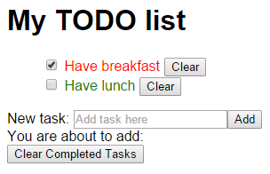

# Your First WebSharper UI.Next Application in 2 Minutes

This project contains the "Markup-driven, strongly-typed reactive applications in minutes" sample from the [WebSharper website](http://websharper.com).

## Dependencies

This project requires WebSharper and WebSharper.UI.Next, and it is configured to fetch these dependencies automatically.

## About this project

You can recreate this project in Visual Studio, Xamarin Studio or CloudSharper by following these steps:

 1. Create a new WebSharper UI.NextSingle-Page Application project.
 2. Open `Client.fs` and replace its contents with the contents of `Client.fs` from this repository.
 3. Add an entry point "`

`" to `index.html` in the body tag before the `<script>` link.

Enjoy!
